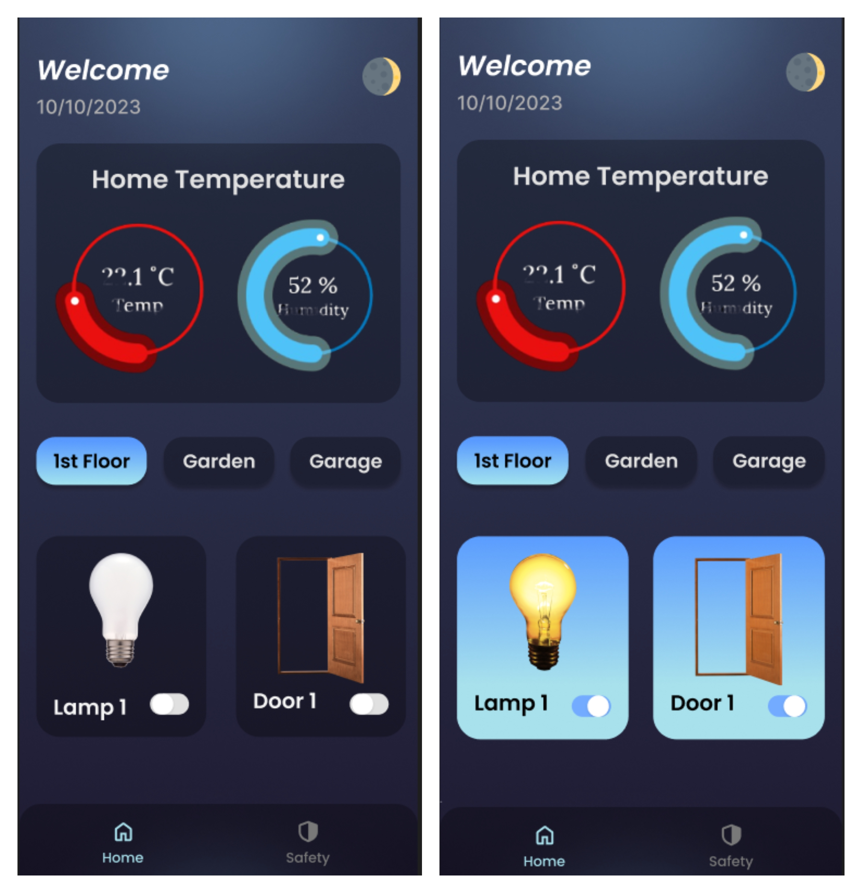
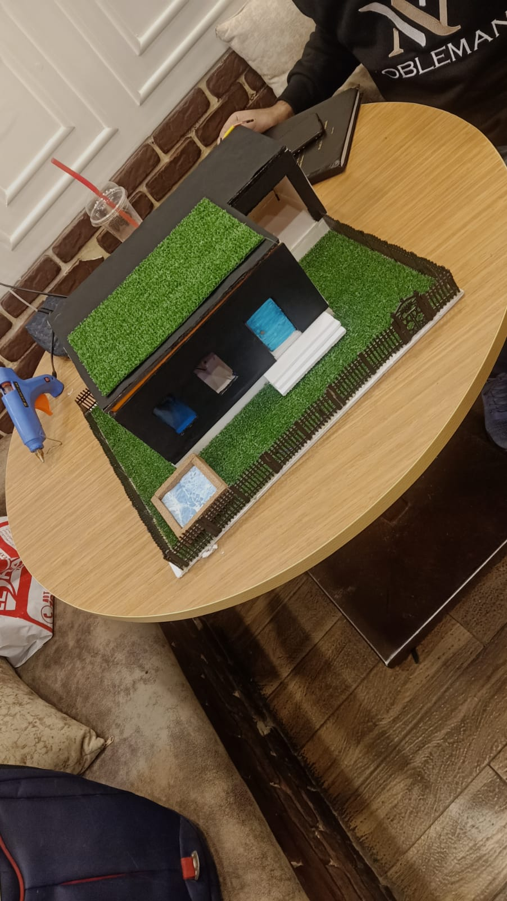
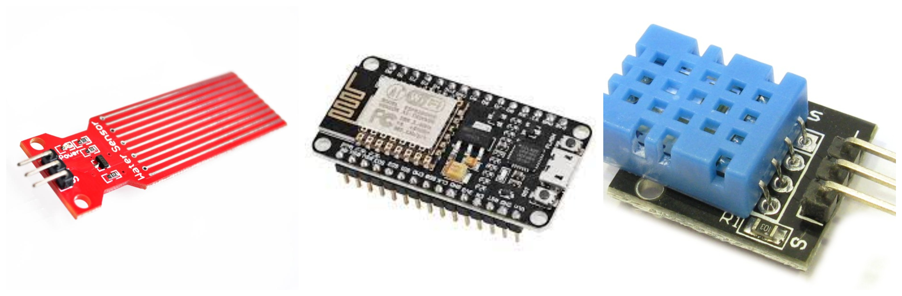
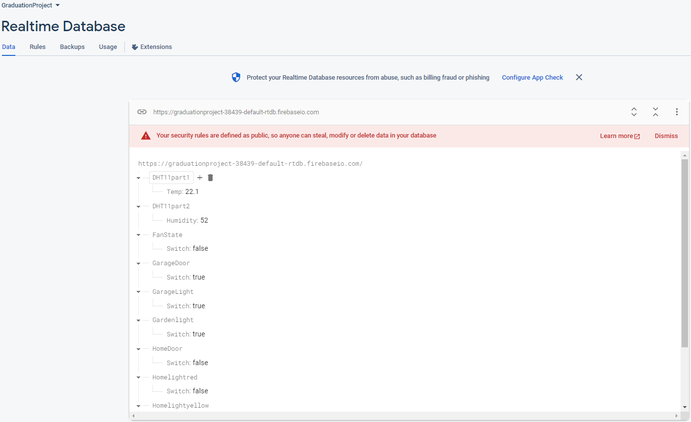

# flutter Graduation Project(Smart-Home-Automation)

Descreption:
We have developed an application to simulate a real home system. Through this Application, you can control all the lighting devices in your home, and you can also control many electrical devices such as (fan). Through this program, you can also know the temperature of the house that is sensed by the sensor that we placed in the house. Using Arduino, and also in the home system, there is a water sensor through which the umbrella can be closed to protect the house from rain automatically. The program has a protection system through which you can lock all the doors and ports of the house, and you can also close all electrical appliances, all of this remotely, so you can do it while you are not there. The house has many features as well, but this is in brief

- firebase realtime database
- Arduino
- bloc state management
- shared preferences
- animated splash screen

# Project Photos
- App ScreenShots

- Maquette & Some Components
  

- Some Components
  

- Realtime Database
  

